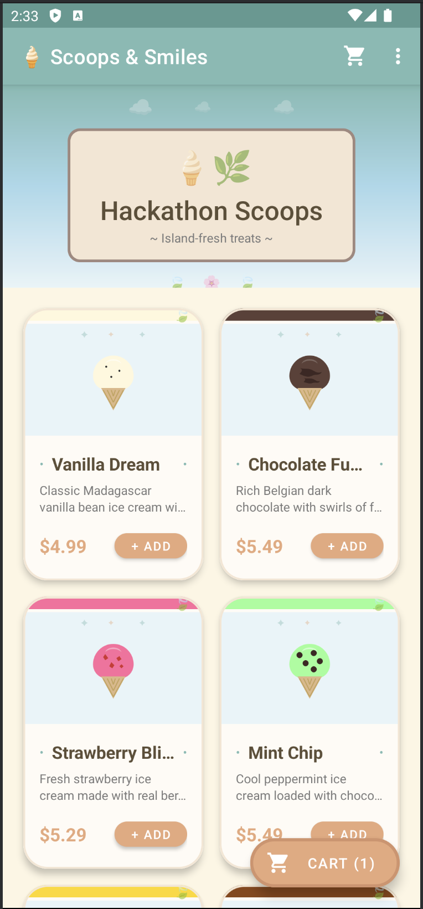

# Ice Cream Shop Demo App

A simple Android demo application for an ice cream shop. This app demonstrates a typical e-commerce flow with product browsing, shopping cart, and checkout functionality.

## Screenshot

<p align="center">
  
</p>

## Features

- 🍦 Browse ice cream flavors in a beautiful grid layout
- 🛒 Add items to shopping cart
- 💳 Complete checkout with order submission

## Requirements

- Android 9.0 (API 28) or later
- Android Studio

## Building the App

1. Clone the repository
2. Open the project in Android Studio
3. Sync Gradle files
4. Run on an emulator or physical device

## Project Structure

```
app/src/main/java/com/icecream/demo/
├── api/
│   └── IceCreamApiService.kt    # Network API service
├── model/
│   ├── IceCream.kt              # Ice cream data model
│   └── CartItem.kt              # Cart item model
├── IceCreamMainActivity.kt      # Main screen with flavor grid
├── CartActivity.kt              # Shopping cart screen
├── CheckoutActivity.kt          # Checkout flow
├── CartManager.kt               # Cart state management
└── IceCreamShopApp.kt           # Application class
```

## Tech Stack

- Kotlin
- AndroidX
- Material Design Components
- OkHttp for networking
- Gson for JSON parsing

## License

See LICENSE.txt for details.
